# ssh 端口转发（建立隧道）


​    SSH端口转发也被称作SSH隧道([SSH Tunnel](http://blog.trackets.com/2014/05/17/ssh-tunnel-local-and-remote-port-forwarding-explained-with-examples.html))，因为它们都是通过SSH登陆之后，在**SSH客户端**与**SSH服务端**之间建立了一个隧道，从而进行通信。SSH隧道是非常安全的，因为SSH是通过加密传输数据的(SSH全称为Secure Shell)，通过ssh端口转发，我们可以实现加密访问目标端口、通过跳板机访问私有云服务、访问外网等操作。

​    SSH有三种端口转发模式，本地端口转发(Local Port Forwarding)，远程端口转发(Remote Port Forwarding)以及动态端口转发(Dynamic Port Forwarding)。对于本地/远程端口转发，两者的方向恰好相反。动态端口转发则可以用于科学上网，总之，各种转发的模式是为了解决访问目标端口不通的情况下，通过访问一个可达的端口上进行转发到目标端口。

​    openssh默认的配置就是支持端口转发的，如果想要ssh端口转发能够正常工作，需要在ssh服务端的配置文件中将`AllowTcpForwarding`的值设置为yes。此处所指的ssh服务端即ssh隧道中的一头，扮演ssh服务端角色的那台主机。

​    当隧道建立以后，经过一段时间后，ssh隧道链接可能会被断开，这有可能是因为ssh客户端和ssh服务端长时间没有通讯，于是ssh服务端主动断开了链接，如果想要解决这个问题，可以在ssh服务端进行配置，调整ssh服务端的`ClientAliveInterval`配置和`ClientAliveCountMax`配置即可。

 对于 ClientAliveCountMax 指如果发现客户端没有相应，则判断一次超时，这个参数设置允许超时的次数。
 ```
 ClientAliveInterval 540 
 ClientAliveCountMax 10000
 ```

 该配置代表允许超时 5400秒 = 90分钟


## 准备实验环境

1. aws中新建三个EC2实例，分别为client, jump, web

2. 将ssh key分别拷贝到本地pc机、client、jump、web服务器的~/.ssh目录下，执行以下命令修改文件权限

   ```
   # 同步命令
   rsync -av -i client-key.pem ./*.pem ubuntu@ip:~/.ssh
   # 修改权限命令
   chmod 400 client-key.pem
   chmod 400 jump-key.pem
   chmod 400 web-key.pem
   ```

   

3. 分别修改本地pc机、client、jump、web服务器的/etc/hosts文件，添加以下配置

   ```
   3.89.249.223 client
   3.89.63.196 jump dev
   34.207.112.164 web
   ```

4. 然后分别修改client、jump、web服务器的hostname

   ```
   sudo hostname client
   sudo hostname jump
   sudo hostname web
   ```

5. 分别在机器上执行以下命令分别启动8888服务

   ```
   # 杀进程命令
   pid=`sudo lsof -i:8888|awk 'NR>1{print $2}'`;ppid=`pstree -aps $pid|tail -n 2|head -1|awk -F, '{print $2}'`;sudo kill -9 $ppid;sudo kill -9 $pid;sudo lsof -i:8888
   # 启动服务命令
   while true; do echo -e "HTTP/1.1 200 OK\n\n from $(hostname): $(date)" | nc -l -p 8888 -q 1; done &
   ```


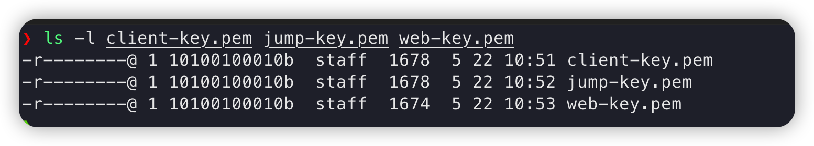

**Note:** my mac是用来操作client、jump、web服务器的，所以允许其访问所有服务的入站流量


 ## 本地转发

 所谓本地端口转发，就是**将发送到本地端口的请求，转发到目标端口**。这样，就可以通过访问本地端口，来访问目标端口的服务。使用**-L**属性，就可以指定需要转发的端口，语法是这样的:

 ```
 -L 本地网卡地址:本地端口:目标地址:目标端口
 ```

 #### 应用场景一：

本地客户端机器需要访问远程机器web的8888端口服务，通过在client端执行命令建立隧道访问

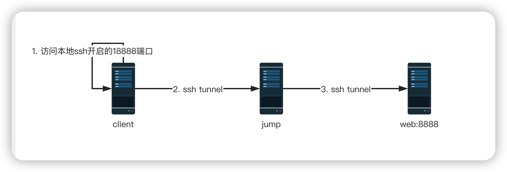

##### 防火墙规则配置

client防火墙规则配置: ClientNotAllowAllInboundButAllowAllOutbound

* 不允许任何入站流量

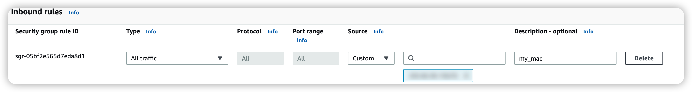


* 允许所有的出站流量

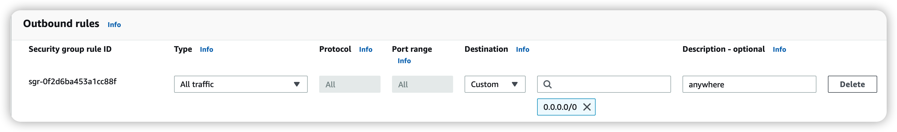

jump防火墙规则配置： JumpAllowClient22InboundAndAllowAccessWebAllOutBound

* 允许client访问jump的22端口

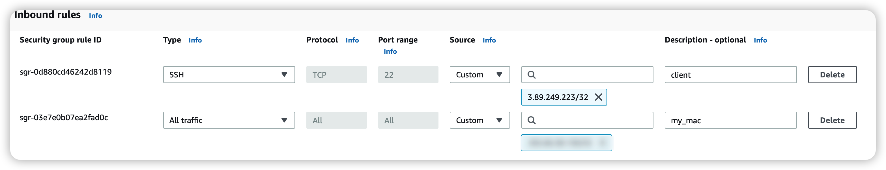

* 允许jump访问web的所有出站流量

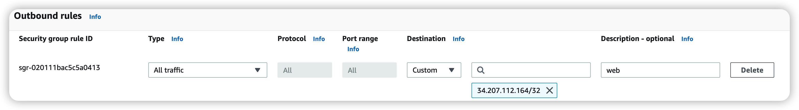

web防火墙规则配置：WebAllowJump22And8888PortInboundNotAllowAllOutBound

* 只允许jump访问22和8888端口

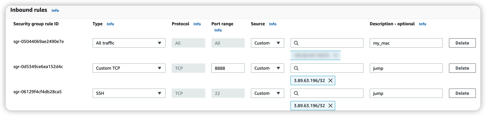

* 不允许所有的outbound流量


##### 建立隧道

建立隧道：通过发送到本地主机18888端口的请求，转发到远程云主机的8888端口

 ```
 ssh -i ~/.ssh/jump-key.pem -fNL  18888:web:8888 ubuntu@jump
 ```

在客户端执行`ss -ntl`命令查看监听的网卡及端口，可以看到只绑定在了127.0.0.1地址上，如果需要绑定到所有网卡，请使用-g参数，如果要绑定到其它网卡，加入网卡ip即可

```
ssh -i ~/.ssh/jump-key.pem -fNL  client:18888:web:8888 ubuntu@jump
```

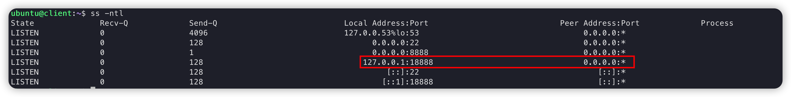

测试：在client端访问本地18888端口连接远程服务器web的8888端口

```
curl http://localhost:18888
```


 #### 应用场景二：

本地客户端机器需要访问远程机器web的8888端口服务，通过在jump端执行命令建立隧道访问

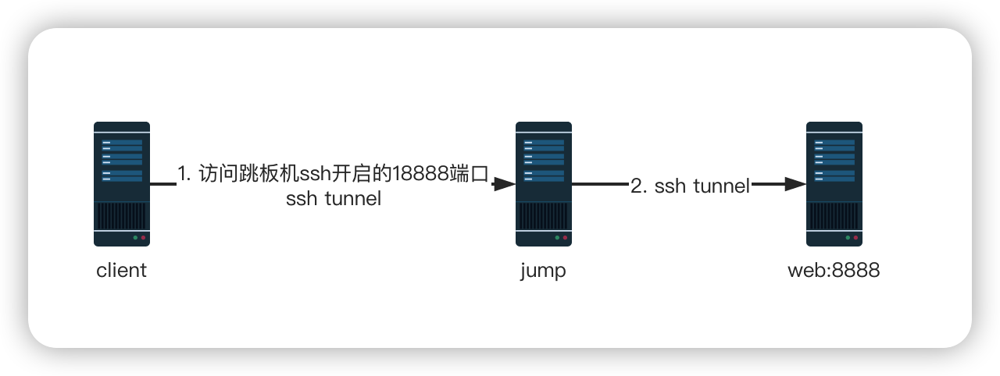

##### 防火墙规则配置

client防火墙规则配置: ClientAllowJump22PortInboundAndAllowAllOutBound

* 只允许jump 22端口的inbound流量

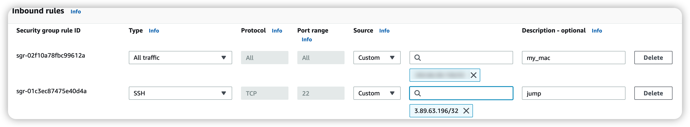


* 允许所有的outbound流量

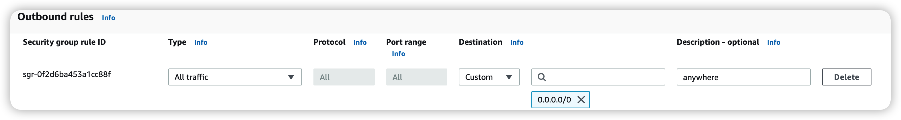

jump防火墙规则配置：JumpAllowClient18888InboundAndAllowAccessClient22AndAllowAccessWebAllOutbound

* 允许client访问18888端口

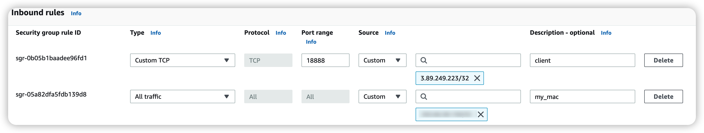

* 允许访问web的所有outbound流量，允许访问client的22端口

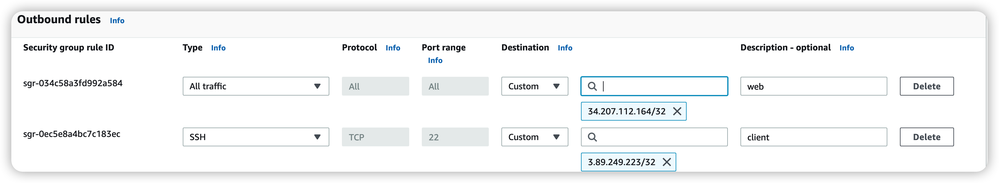

web防火墙规则配置：WebAllowJump22And8888PortInboundNotAllowAllOutBound

* 只允许jump访问22和8888端口


* 不允许所有的outbound流量


##### 建立隧道 

通过发送到跳板机本地18888端口的请求，转发到远程云主机的8888端口。如果报permission denied，则把跳板机上~/.ssh/id_rsa.pub或者其它路径的public key 拷贝到跳板机的~/.ssh/authorized_keys文件中
​	如果希望jump中的所有IP地址的18888端口都被监听，那么可以在建立隧道时开启"网关功能"，使用"-g"选项可以开启"网关功能"，开启网关功能以后，jump中的所有IP都会监听对应端口，示例如下

 ```
 ssh -i ~/.ssh/jump-key.pem -g -fNL 18888:web:8888 ubuntu@127.0.0.1
 ```

 在jump中执行`ss -ntl`命令查看监听的网卡及端口，可以看到18888端口绑定了到了jump服务器的所有网卡上

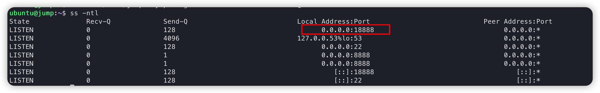

测试，在client机器访问jump server的18888端口

```
curl http://jump:18888
 # 测试完杀掉建立的所有隧道
killall ssh
```


 ## 远程转发

 所谓远程端口转发，就是将发送到远程端口的请求，转发到目标端口。这里的远程指的是相对于执行建立隧道命令的机器的远程服务器。使用-R属性，就可以指定需要转发的端口，语法是这样的:
 ```
 -R 远程网卡地址:远程端口:目标地址:目标端口 
 ```
 #### 应用场景一：

开发机可以访问服务器，但是服务器一般是不可以访问本地client端,我要在开发环境机器访问我本地的8888端口服务

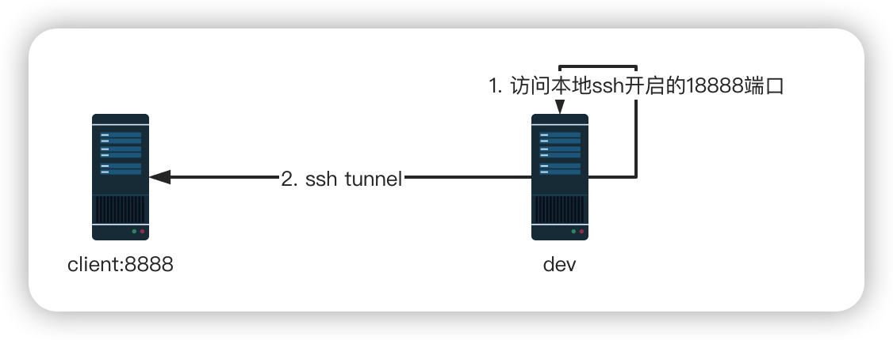

##### 防火墙规则配置

client防火墙规则配置: ClientNotAllowAllInboundButAllowAllOutbound

* 不允许dev(jump)机器的访问

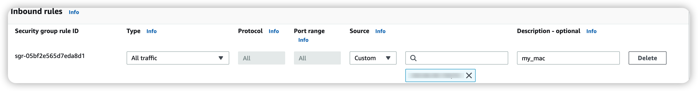


* 允许所有的outbound流量


dev(jump)防火墙规则配置：JumpAllowClientInboundButNotAllowOutBoundTraffic

* 允许client的inbound流量

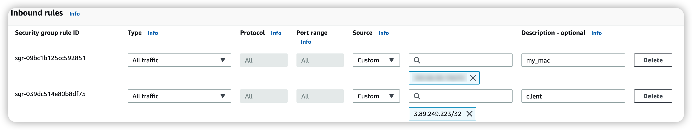

* 不允许jump访问client的outbound流量

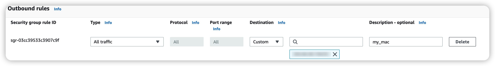

##### 建立隧道

在本地机器执行命令建立隧道远程转发开发环境的18888端口到本地的8888端口。这里的18888端口是在开发环境开启的

 ```
 ssh -i ~/.ssh/jump-key.pem -f -N -R 18888:127.0.0.1:8888 ubuntu@dev
 ```
在开发机器（jump)执行`ss -ntl`命令查看监听的网卡及端口，可以看到只绑定在了127.0.0.1地址上，远程转发只会绑定到127.0.0.1地址，不会绑定到其它地址，不支持网关功能

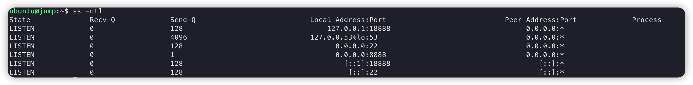

测试：在开发环境机器（jump）上执行curl命令测试

```
curl http://localhost:18888
# 测试完杀掉建立的所有隧道
killall ssh
```


#### 应用场景二：

 本地机器想访问企业内部私有云web服务，监听8888端口, 跳板机只出不进，所以只能通过跳板机执行命令建立隧道，将访问到本地机器上的18888端口的流量转发到私有云服务器（需要跳板机可以ssh连接上本地机器）

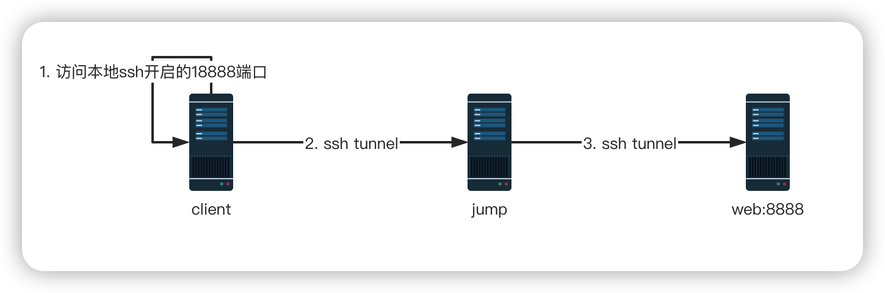

##### 防火墙规则配置

client防火墙规则配置: ClientAllowJump22PortInboundAndAllowAllOutBound

* 只允许jump 22端口的inbound流量


* 允许所有的outbound流量


jump防火墙规则配置: JumpNotAllowAllInboundButAllowAllOutBound

* 不允许任何inbound流量

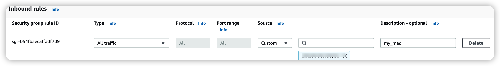

* 允许所有outbound流量

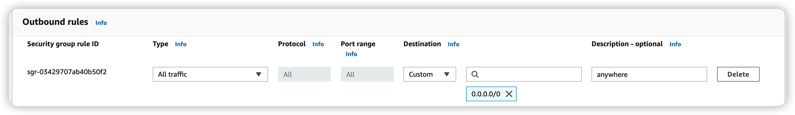

web防火墙规则配置：WebAllowJump22And8888PortInboundNotAllowAllOutBound

* 只允许jump访问22和8888端口


* 不允许所有的outbound流量


##### 建立隧道

在跳板机上执行命令，通过ssh隧道将发送到本地机器上18888端口的流量转发到web服务器的8888端口

 ```
ssh -i ~/.ssh/client-key.pem -f -N -R 18888:web:8888 ubuntu@client
 ```

在client机器执行`ss -ntl`命令查看监听的网卡及端口，可以看到只绑定在了127.0.0.1地址上，远程转发只会绑定到127.0.0.1地址，不会绑定到其它地址，远程转发不支持网关功能

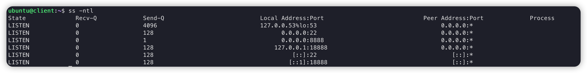

 测试：在客户端执行

```
curl http://localhost:18888
# 测试完杀掉建立的所有隧道
killall ssh
```


## 链式转发

 **本地端口转发**与**远程端口转发**结合起来使用，可以进行链式转发。

#### 应用场景一：

本地客户端想访问远程web server的8888端口，但是由于8888端口不对外开发，只给jump server开放8999端口，并且jump server只出不进。这里我们就可以分成两步来转发到目标服务。首先在web server上执行本地转发命令，将本机8999端口的请求转发到8888端口。由于jump server只出不进，那么只能有jump server向client主动发起建立ssh的请求。在jump server上执行远程转发命令，将client机器上的18888端口的请求转发到web server的8999端口

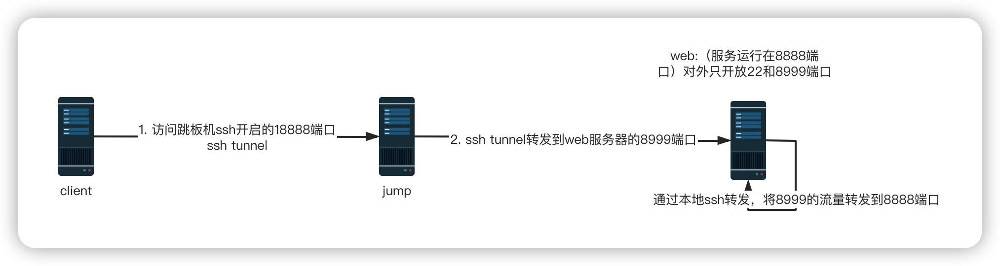

##### 防火墙规则配置

client防火墙规则配置: ClientAllowJump22PortInboundAndAllowAllOutBound

* 只允许jump 22端口的inbound流量


* 允许所有的outbound流量


jump防火墙规则配置: JumpNotAllowAllInboundButAllowAllOutBound

* 不允许任何inbound流量


* 允许所有outbound流量


web防火墙规则配置：WebAllowJump22And8999PortInboundNotAllowAllOutBound

* 只允许jump访问web的22和8999inbound流量

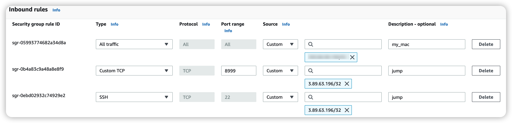

* 不允许所有的outbound流量


1. 在web server上执行本地转发命令，将本机8999端口的请求转发到8888端口

```
ssh -i ~/.ssh/web-key.pem -g -f -N -L 8999:127.0.0.1:8888 127.0.0.1
```

在web机器执行`ss -ntl`命令查看监听的网卡及端口，可以看到只绑定在了所有的ip上，因为我们使用了-g网关功能

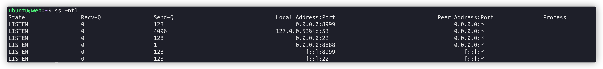

在web server上执行curl命令测试

```
curl http://localhost:8999
```


2. 在jump server上执行远程转发命令，将client机器上的18888端口的请求转发到web server的8999端口

```
ssh -i ~/.ssh/client-key.pem -f -N -R 18888:web:8999 ubuntu@client
```

在client机器执行`ss -ntl`命令查看监听的网卡及端口，可以看到只绑定在了127.0.0.1地址上，远程转发只会绑定到127.0.0.1地址，不会绑定到其它地址，远程转发不支持网关功能

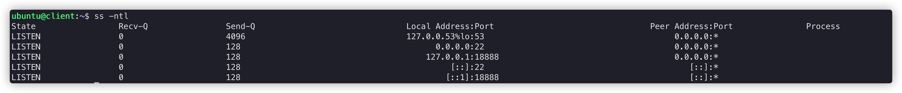

在client端执行curl命令测试，可以看到收到了web的响应

```
curl http://localhost:18888
```


 ## 动态转发

 #### 应用场景一：

 如果需要在国内访问国外网络资源，而自己在国外有一台服务器jump，这样我们就可以利用ssh命令进行科学上网

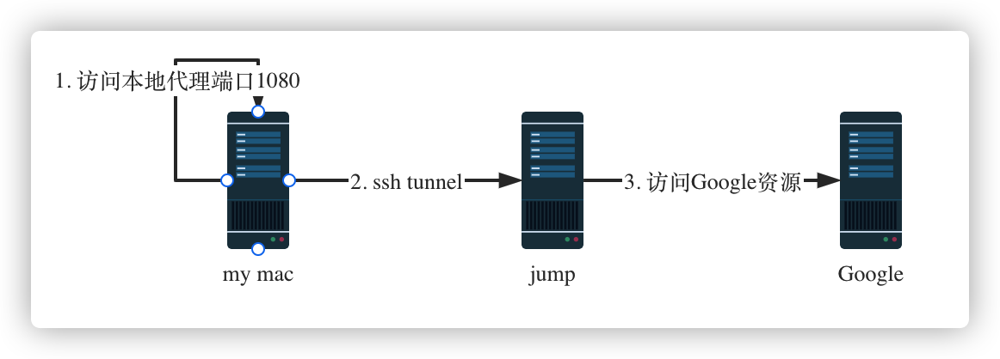


##### 防火墙规则配置

jump防火墙规则：JumpAllowMyMacAllInboundAndAllowAllOutBound

* 允许my mac访问jump所有流量

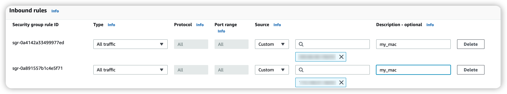

* 允许访问所有的出站流量

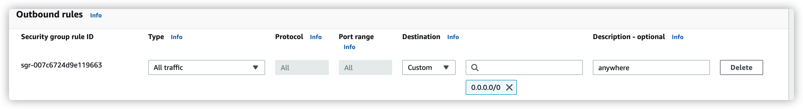

确保jump可以访问Google

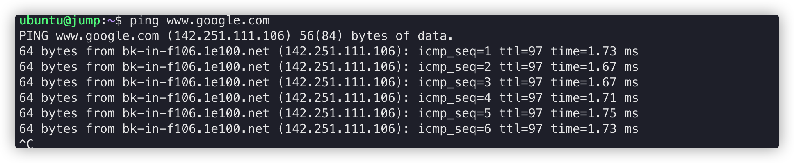

在建立隧道之前，测试下浏览器是否可以访问Google，可以看到访问不了

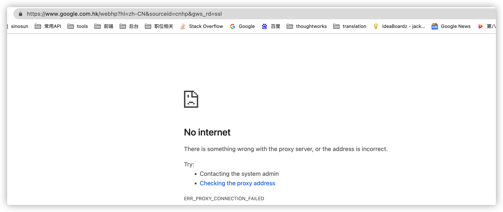

##### 建立隧道

在my mac上执行命令建立隧道

 ```
   ssh -i ~/.ssh/jump-key.pem -g -D 1080 -fN ubuntu@jump
 ```

在my mac上执行`netstat -na | grep 1080`命令查看监听的网卡及端口，可以看到只绑定在了所有的ip上，因为我们使用了-g网关功能

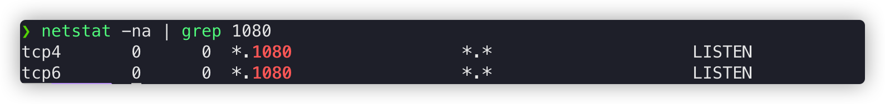

通过curl验证

 ```
 curl --socks5 127.0.0.1:1080 www.google.com
 ```

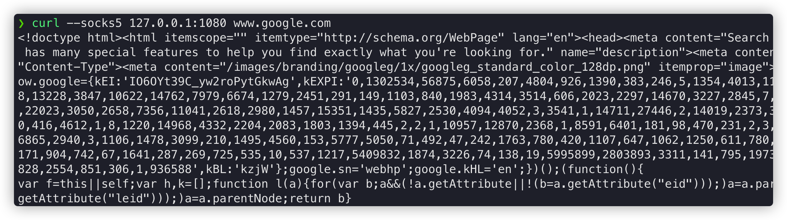

将代理设置为全局代理测试

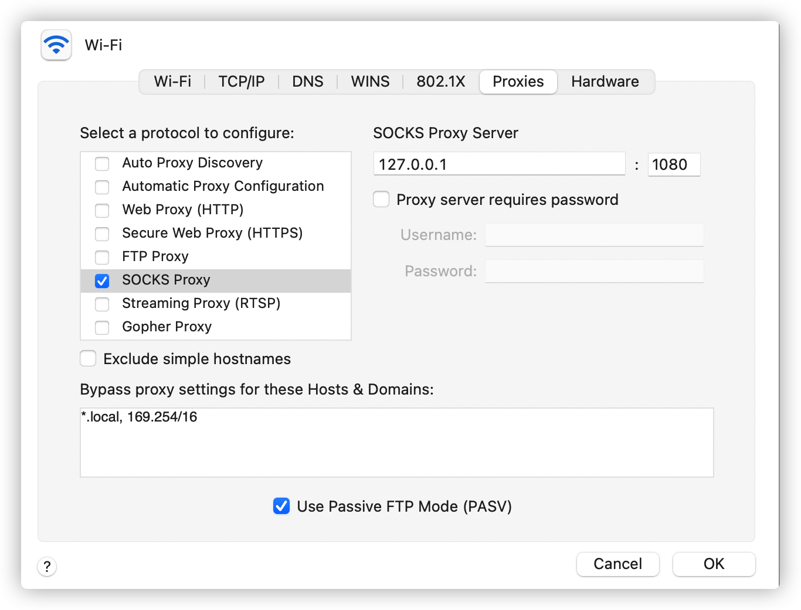

使用浏览器访问测试

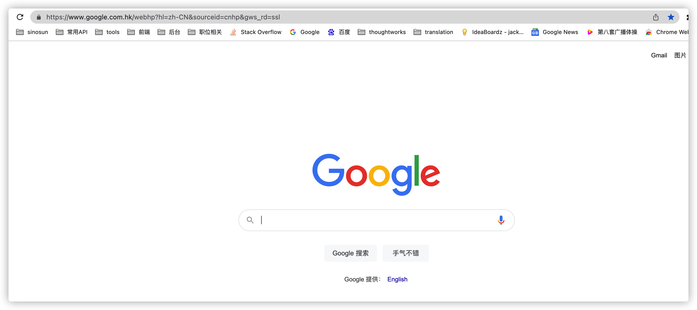